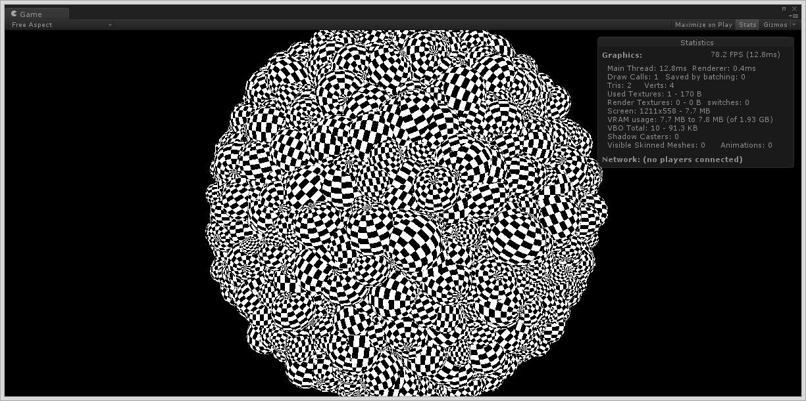

InstancingExampleUnity
======================
An Example of Geometry Instancing for Unity.

 * Only 1 Drawcall
 * Batching is 0
 * DirectX 11 required
 * Vertex shader may limit instancing performance (DrawProcedural() doesn't support vertex indexing)

## Example
10000 Instanced Mesh. 

